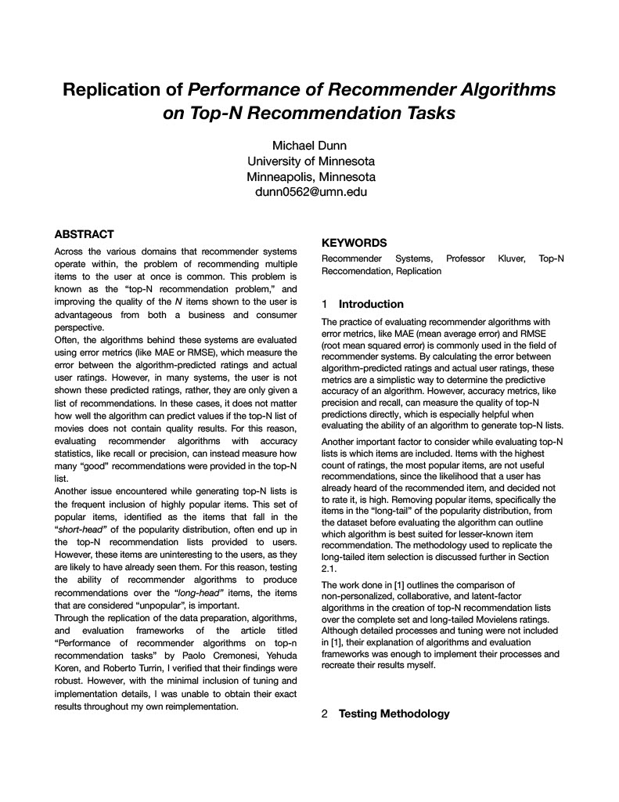
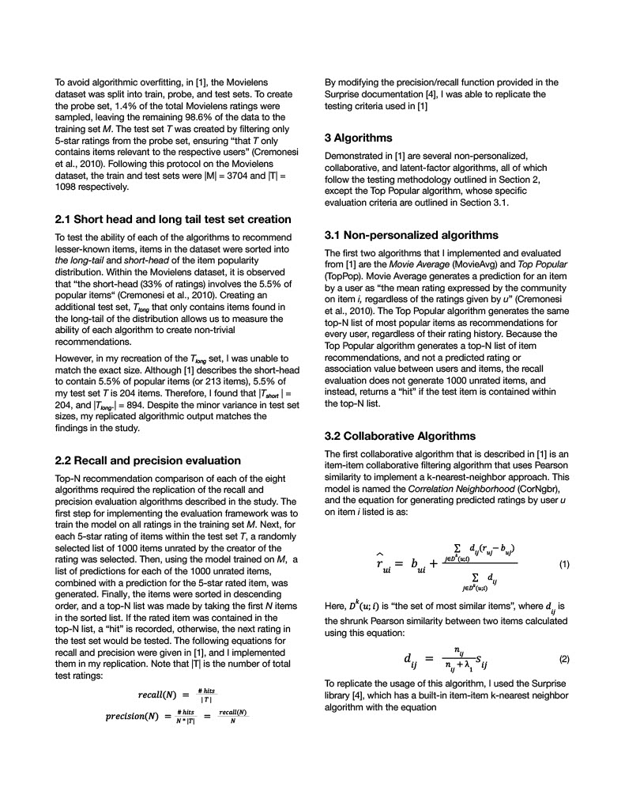
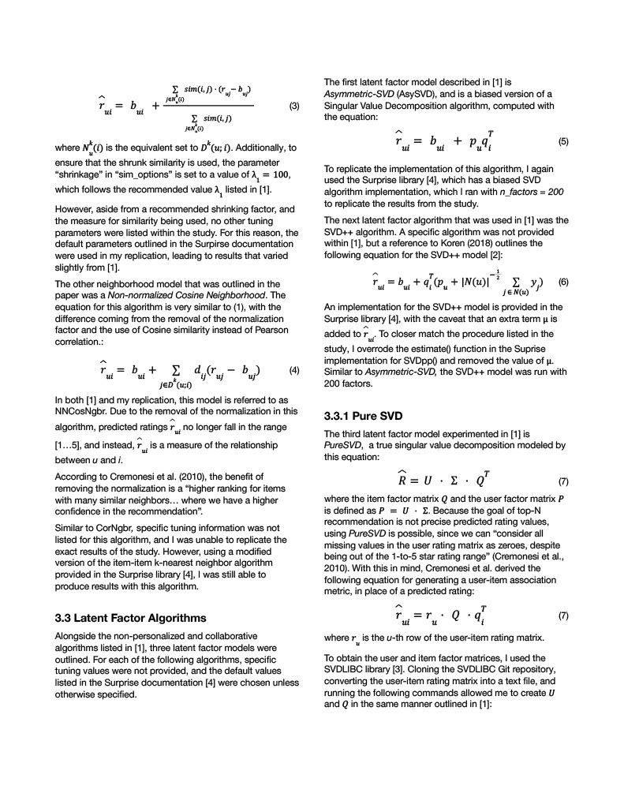
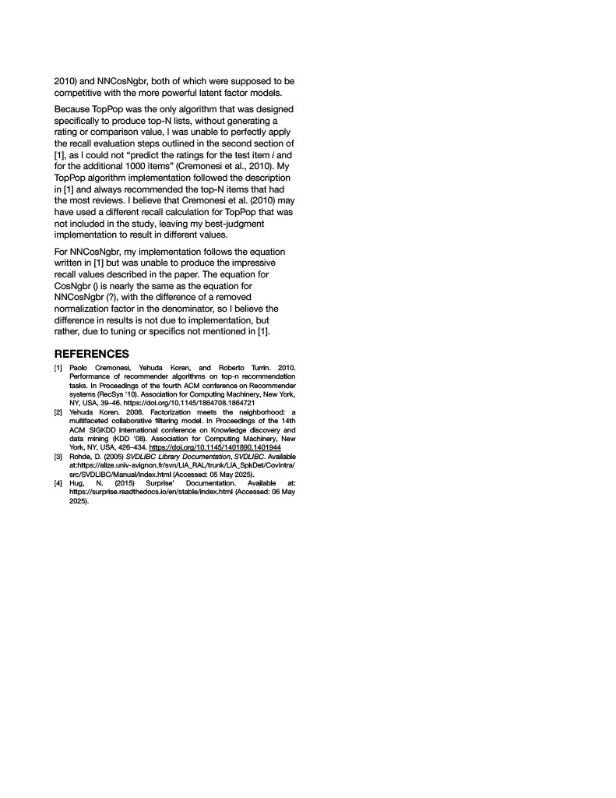

# Recommender Systems Replication
### A replication of the paper "Performance of recommender algorithms on top-n recommendation tasks" by Paolo Cremonesi, Yehuda Koren, and Roberto Turrin.

https://dl.acm.org/doi/10.1145/1864708.1864721

This replication features 8 of the recommender algorithms featured in the paper and their performance completing the top-N recommendation task on the Movielens 1M dataset. 

    

    

    

    

    

